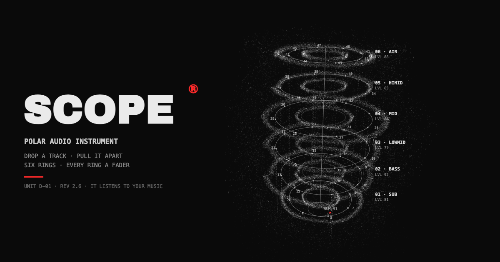

# SCOPE®



A star made of 58,000 particles that listens.

The shell is a fibonacci sphere displaced by three octaves of drifting 3D
simplex noise: bass swells the photosphere, mids drive the boil, highs add
grain, and every real beat erupts matter off the surface (a pooled ejecta
system, simulated entirely in the vertex shader as closed-form drag arcs).
It reads the whole track's peaks up front, so the surface tension rises a
few seconds *before* a drop lands. Grab it and spin it; it drifts on its
own the rest of the time.

Around it: a tactical-telemetry console. Full-track waveform scrubber with
a red playhead, live 24-band spectrum, a survey grid whose sweep speed
rides the bass (Web Animations `playbackRate`), a title block with real
values, tick rulers, a reticle cursor, and display-type track
announcements that decode character by character.

Built with Vite + React + TypeScript + Three.js. No backend.

## Run

```bash
npm install
npm run dev
```

## Audio

The house radio ships with 12 public-domain (CC0) tracks from
[FreePD](https://freepd.com) — no rights reserved, redistribution
permitted. And it's still yours to feed:

- **Drop any audio file anywhere** — peaks decode in-browser, the strip
  becomes a scrubber, the star gets its future-sight.
- **Mic** visualizes the room live.

To change the radio: swap mp3s in `public/tracks/`, list them in
`src/data/tracks.ts`, and pre-compute overview peaks (audiowaveform-
compatible JSON, needs ffmpeg):

```bash
python3 scripts/generate-peaks.py
```

## Deploy

Any static host. For rich social cards, set the deploy origin at build
time (see `.env.example`):

```bash
VITE_SITE_URL=https://your-domain npm run build
```

## Design

Industrial-brutalist telemetry: `#0a0a0a` substrate, white phosphor ink,
one hazard red, Archivo Black + JetBrains Mono (self-hosted), zero rounded
corners, real values only. Every animation honors
`prefers-reduced-motion`.
